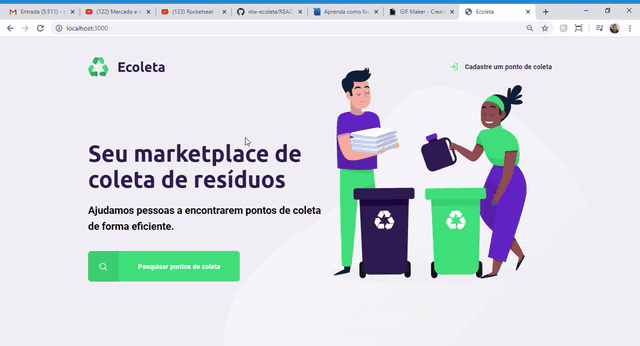

<h1 align="center">
    
</h1>

<h1 align="center">
    
</h1>

## 🐱‍💻 Sobre

O projeto **Ecoleta** é uma aplicação desenvolvida em uma semana na primeira edição do evento **Next Level Week** da Rocketseat. O objetivo é por em prática o aprendizado de cada dia de aula.

---

## ✔ Tecnologias utilizadas

- HTML
- CSS3
- JavaScript
- NodeJs
- Nunjuncks
- Express
- SQLite3

---

## ✈ Como baixar o projeto

```bash

    # Clonar o repositório
    $ git clone https://github.com/souza-anderson/nlw-ecoleta

    # Entrar no diretório do projeto
    $ cd nlw-ecoleta

    # Instalar as dependências
    $ npm install

    # Executar o projeto
    $ npm start

```
---
## :page_facing_up: Licença
Desenvolvido por Anderson Souza e sob a licença [MIT](/LICENSE).
